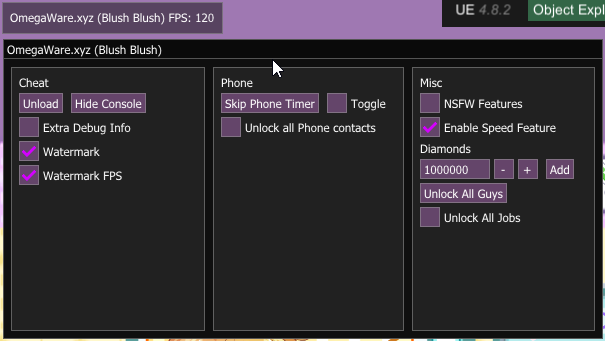
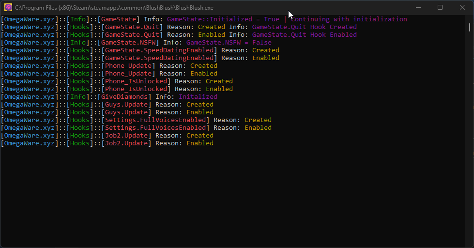

# Blush Blush Cheat
A cheat made for the Steam version of <a href="https://store.steampowered.com/app/777130/Blush_Blush/">Blush Blush

Check out my cheat for <a href="https://github.com/Omega172/Crush-Crush-Cheat">Crush Crush

The key to show/hide the GUI is "Insert"

# How to use

1. Download and install the dependencies listed in the README, restart PC after installing dependencies.
2. Either compile the DLL or download the compiled one from [Releases](https://github.com/Omega172/Blush-Blush-Cheat/releases/latest).
3. Using a DLL injector of your choice Inject the DLL into BlushBlush.exe.

For a DLL injector, if you are very new to this I recommend [Process Hacker](https://processhacker.sourceforge.io/)

[How to inject DLL with Process Hacker](https://www.unknowncheats.me/forum/general-programming-and-reversing/378956-process-hacker-2-inject-dll-game.html)

# Why?
Because I made a cheat for Crush Crush, and this games code is mostly the same as Crush Crush

# Dependencies
Mono - https://www.mono-project.com/download/stable/ (Only if you want to compile this yourself) 
Microsoft Visual C++ Redistributable x86 - https://aka.ms/vs/17/release/vc_redist.x86.exe 
Microsoft Visual C++ Redistributable x64 - https://aka.ms/vs/17/release/vc_redist.x64.exe 
DirectX End-User Runtimes (June 2010) - http://www.microsoft.com/en-us/download/confirmation.aspx?id=8109

# Images

# Features
<li  class="has-line-data"  data-line-start="8"  data-line-end="9">An in-game menu created by hooking the games Direct-X 11 with Keiro and using Dear-ImGui to render</li>

<li  class="has-line-data"  data-line-start="9"  data-line-end="10">The ability to unload the DLL at anytime to resume normal game function</li>

<li  class="has-line-data"  data-line-start="10"  data-line-end="11">A console attached to the game used for outputting debug information and hook status with a button to enable and disable it</li>

<li  class="has-line-data"  data-line-start="11"  data-line-end="12">A simple watermark in the top right corner that displays the cheat’s title and the current FPS</li>

<li  class="has-line-data"  data-line-start="12"  data-line-end="14">Hooks for many of the games internal functions using MinHook</li>
